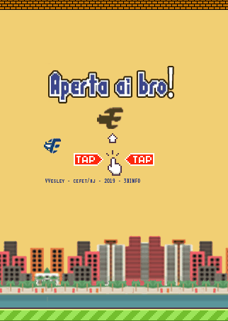
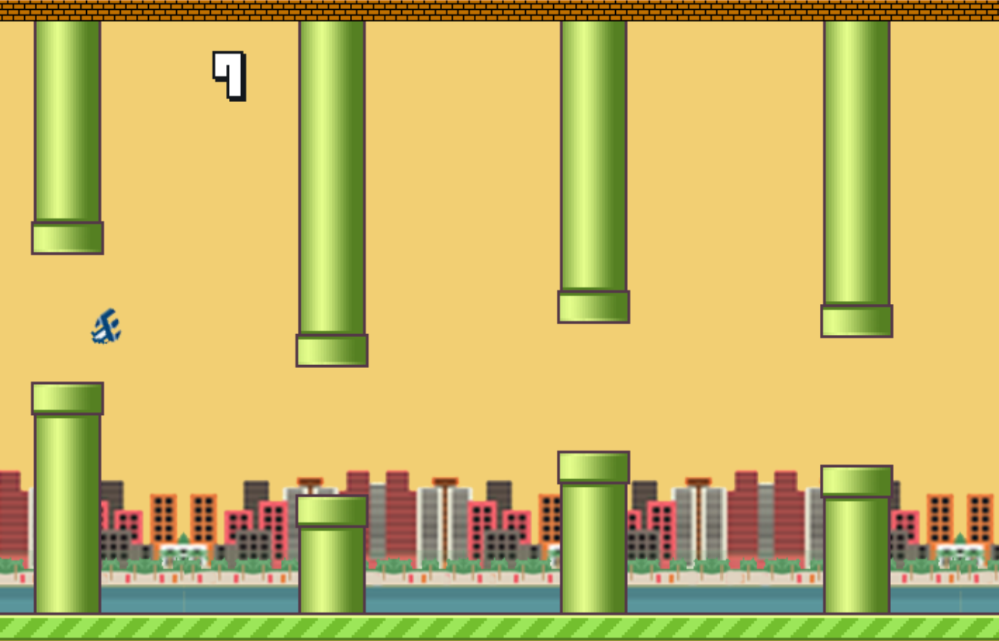

# Flappy-Bird

   
  <h2 align="center">Flappy Bird</h2>
  
-----

  
    

---

Flappy Bird fidedigno ao oficial em HTML, CSS, JS. Utilizando JQuery e Buzz.

---

  
    

### Site Estatico:
https://vvesley-cefetbird.netlify.com/

Referencias
----
Conteudo aprendido na lista do canal com tutorial em JS para desenvolver o Flappy Bird.
https://www.youtube.com/watch?v=cWytvkJPlMw&list=PL2oxkOy6egcD8MT55Sj1TwkAf9LQpqQuJ&index=21&t=115s
